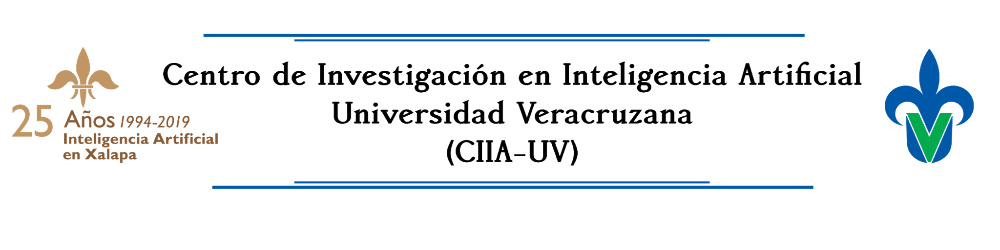

# Introduccion a la Ciencia de Datos con Python 

Este repositorio contiene las libretas para el Taller Ciencia de Datos con Python que se lleva a cabo los días 29, 30 y 31 de enero del 2020 en el Centro de Investigación en Inteligencia Artificial de la UV. 

El material está basado en los siguientes documentos 

* [Python Data Science Handbook](http://shop.oreilly.com/product/0636920034919.do) de Jake VanderPlas (disponible [en GitHub](https://github.com/jakevdp/PythonDataScienceHandbook)
* [Thoughtful Machine Learning with Python](http://shop.oreilly.com/product/0636920039082.do) de Matthew Kirk (disponible [en Github](https://github.com/thoughtfulml/examples-in-python))
* 

## Acerca del Taller

Este taller surge como una propuesta a partir de diversas experiencias en las que el autor ha identificado:

1. el interes que despierta el tema de Ciencia de Datos en la actualidad,
2. el interes de aprender un lenguaje de programacion simple y efectivo para resolver problemas y 
3. la necesidad de promover una competencia adecuada en programacion entre estudiantes e interesados

Adicionalmente se presenta como una oportunidad para promover el lenguaje de programacion Python en el contexto de su aplicación para el análisis de datos en busca de soluciones a problemas que permean a la Industria Mexicana. 

El objetivo del Taller es presentar una introducción general al ecosistema del lenguaje de programación útiles para el análisis de datos, y al mismo tiempo enseñar los fundamentos de programación usando el lenguaje Python, en particular [IPython](http://ipython.org), [NumPy](http://numpy.org), [Pandas](http://pandas.pydata.org), [Scikit-Learn](http://scikit-learn.org), y librerías relacionadas, asi como aplicaciones específicas basadas en problemas de origen industriales. 

## Software

El Taller se realiza usando el ambiente en la nube [Colab](https://colab.research.google.com/) de Google, ya que reduce el tiempo de instalacion y preparacion de requisitos necesarios para poder comenzar a usar el lenguaje de programacion cuanto antes. Puede usarse en un entorno de ejecucion local [siguiendo las instrucciones del sitio original](https://github.com/jakevdp/PythonDataScienceHandbook).

## Licencia
Se mantienen las licencias originales de los textos consultados la que se reproduce íntegramente a continuación.

### Code
The code in this repository, including all code samples in the notebooks listed above, is released under the [MIT license](LICENSE-CODE). Read more at the [Open Source Initiative](https://opensource.org/licenses/MIT).

### Text
The text content of the book is released under the [CC-BY-NC-ND license](LICENSE-TEXT). Read more at [Creative Commons](https://creativecommons.org/licenses/by-nc-nd/3.0/us/legalcode).
